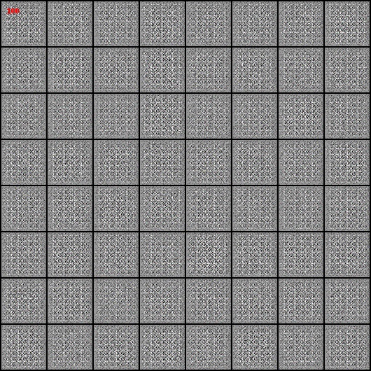

# Continuous cGAN

Onenote address: https://1drv.ms/u/s!Arj2pETbYnWQo5dkN7nmDPnGFoz-aw?e=r8JhnH

# 1. Quick Check 1: Standard DCGAN/cDCGAN/WGANGP/cWGANGP on VGG dataset (Cell Counting)

## DCGAN

## cDCGAN without normalizing count number

## cDCGAN with normalizing count number

## WGANGP

## cWGANGP with normalizing count number

# 2. Quick Check 2: cDCGAN on MNIST without One-hot Encoding and Label Embedding

