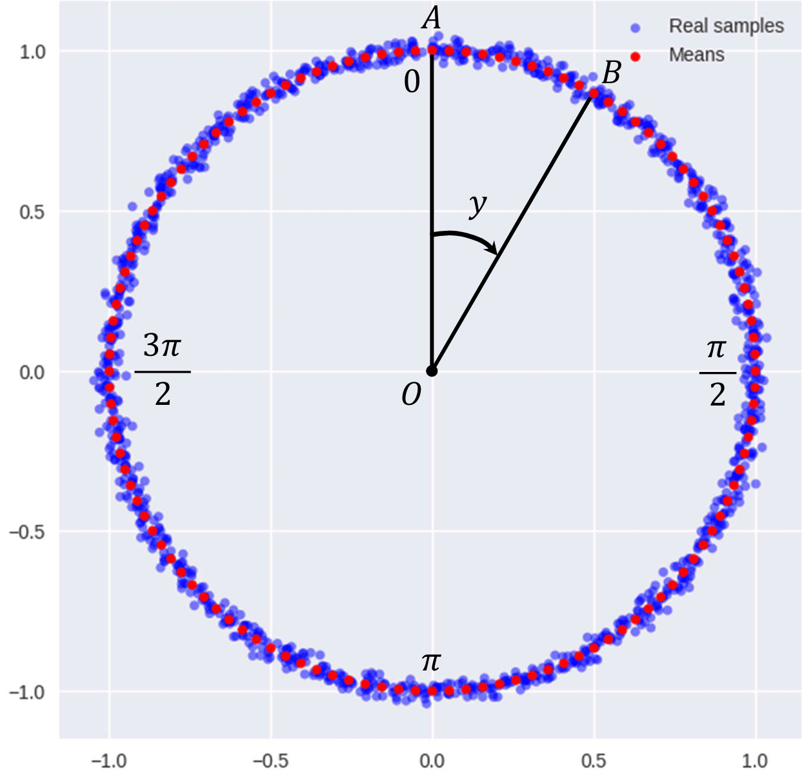
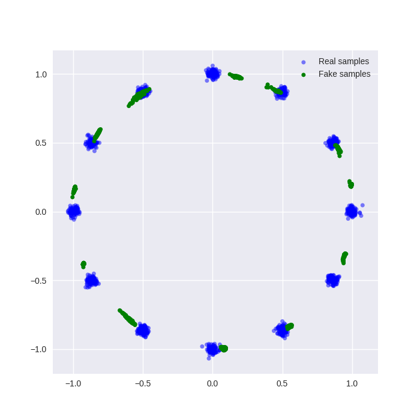
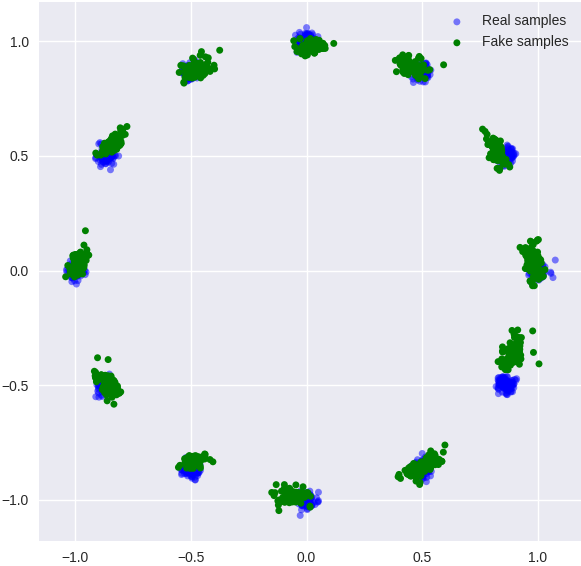
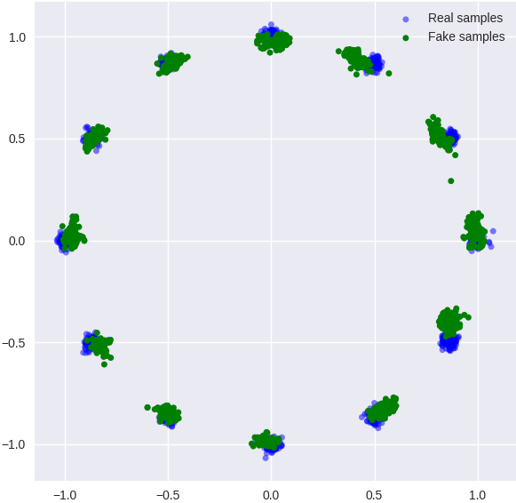
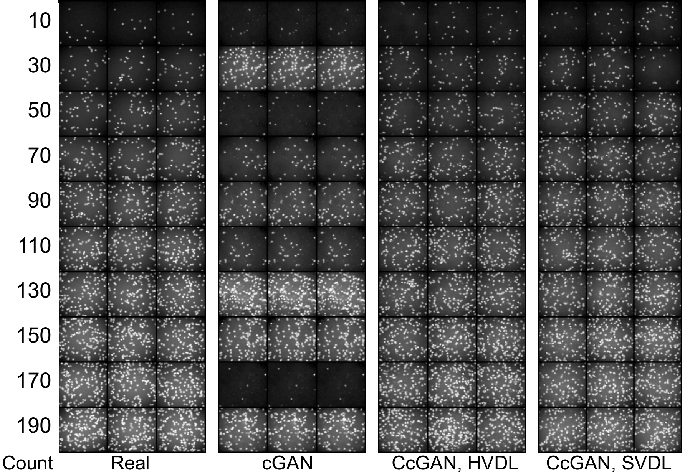
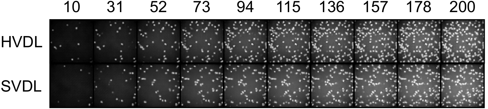

# Continuous cGAN

Onenote address: https://1drv.ms/u/s!Arj2pETbYnWQo5dkN7nmDPnGFoz-aw?e=r8JhnH

# 1. Datasets
## Cell-300 Dataset
https://1drv.ms/u/s!Arj2pETbYnWQqvApwbxaJxqjlaU1gQ?e=cH01jx

## Steering Angle Dataset
https://github.com/SullyChen/driving-datasets 

# 2. Experiments

## 2.1 Simulation: Gaussians on a unit circle
Refer to https://docs.google.com/spreadsheets/d/1bWYXQBbMjRaxizWJndddFJJi-r1L0d6qB6cto34ICvw/edit?usp=sharing

## Training data

## cGAN

## HVDL: sigma and kappa are computed base on the rule of thumb rule

## SVDL: sigma and kappa are computed base on the rule of thumb rule

## 2.2 Cell-200
Refer to https://docs.google.com/spreadsheets/d/13S9xVsWKAMDdc34ke8CZIvxiU3vACaCr1EWi_B_xXFE/edit?usp=sharing 

## Data generation for 10 unseen cell counts

## CcGAN: Fix z but vary y

