# Continuous Conditional Generative Adversarial Networks

**[UPDATE! 2021-07-28]** We provide codes for training CcGAN on **high-resolution** RC-49, UTKFace, and Steering Angle where the resolution varies from **128x128** to **256x256**. We also provide simplified codes for computing NIQE. <br />
**[UPDATE! 2021-07-27]** We add a new baseline cGAN (concat) which directly appends regression labels to the input of generator and the last hidden map of discriminator. cGAN (K classes) and cGAN (concat) are two modifications on conventional cGANs (to fit the regression scenario) and they show two types of failures of conventional cGANs. (1) cGAN (K classes) has high label consistency but bad visual quality and low intra-label diversity. (2) cGAN (concat) has high intra-label diversity but bad/fair visual quality and terrible label consistency. <br />
**[UPDATE! 2021-01-13]** A conference version of CcGAN is accepted by ICLR 2021. <br />

--------------------------------------------------------

This repository provides the source codes for the experiments in our papers for CcGANs. <br />
If you use this code, please cite
```text
@inproceedings{
      ding2021ccgan,
      title={Cc{GAN}: Continuous Conditional Generative Adversarial Networks for Image Generation},
      author={Xin Ding and Yongwei Wang and Zuheng Xu and William J Welch and Z. Jane Wang},
      booktitle={International Conference on Learning Representations},
      year={2021},
      url={https://openreview.net/forum?id=PrzjugOsDeE}
}

@article{ding2020continuous,
  title={Continuous Conditional Generative Adversarial Networks: Novel Empirical Losses and Label Input Mechanisms},
  author={Xin Ding and Yongwei Wang and Zuheng Xu and William J. Welch and Z. Jane Wang},
  journal={arXiv preprint arXiv:2011.07466},
  year={2021}
}
```

--------------------------------------------------------

# Repository Structure

```
├── RC-49
│   ├── RC-49_64x64
│   │   ├──CcGAN
│   │   ├──CcGAN-improved
│   │   └──cGAN-concat
│   ├── RC-49_128x128
│   │   └──CcGAN-improved
│   └── RC-49_256x256
│       └──CcGAN-improved
├── UTKFace
│   ├── UTKFace_64x64
│   │   ├──CcGAN
│   │   ├──CcGAN-improved
│   │   └──cGAN-concat
│   ├── UTKFace_128x128
│   │   └──CcGAN-improved
│   └── UTKFace_192x192
│       └──CcGAN-improved
├── Cell-200
│   └── Cell-200_64x64
│       ├──CcGAN
│       ├──CcGAN-improved
│       └──cGAN-concat
├── SteeringAngle
│   ├── SteeringAngle_64x64
│   │   ├──CcGAN
│   │   ├──CcGAN-improved
│   │   └──cGAN-concat
│   └── SteeringAngle_128x128
│       └──CcGAN-improved
└── NIQE
    ├── RC-49
    │   ├── NIQE_64x64
    │   ├── NIQE_128x128
    │   ├── NIQE_256x256
    ├── UTKFace
    │   ├── NIQE_64x64
    │   ├── NIQE_128x128
    │   └── NIQE_192x192
    ├── Cell-200
    │   └── NIQE_64x64
    └── SteeringAngle
        ├── NIQE_64x64
        └── NIQE_128x128
```

--------------------------------------------------------

# The overall workflow of CcGAN

<p align="center">
  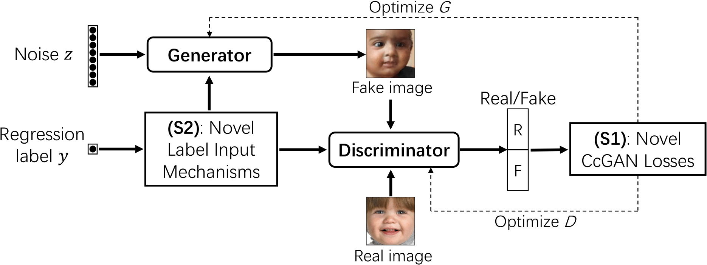
  The overall workflow of CcGAN. Regression labels are input into the generator and the discriminator by novel label input mechanisms (NLI and ILI). Novel empirical losses (HVDL, SVDL, and a generator loss) are used to train the generator and discriminator. CcGAN can also employ modern GAN architectures (e.g., SNGAN and SAGAN) and training techniques (e.g., DiffAugment).
</p>

--------------------------------------------------------

# Hard Vicinal Discriminator Loss (HVDL) and Soft Vicinal Discriminator Loss (SVDL)

<p align="center">
  
  The formulae for HVDL and SVDL.
</p>

An example of the hard vicinity                  |  An example of the soft vicinity
:-------------------------:|:-------------------------:
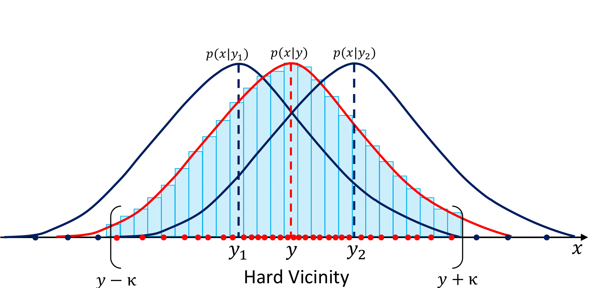  |  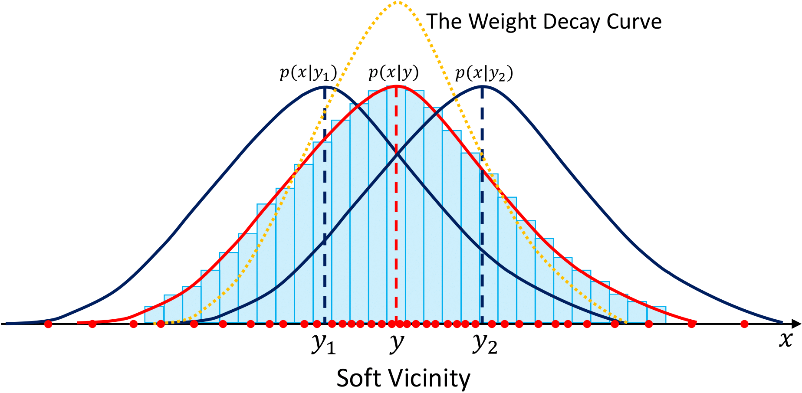


--------------------------------------------------------

# Naive Label Input (NLI) and Improved Label Input (ILI) Mechanisms

<!-- NLI for G                  |  NLI for D
:-------------------------:|:-------------------------:
  |   -->

<p align="center">
  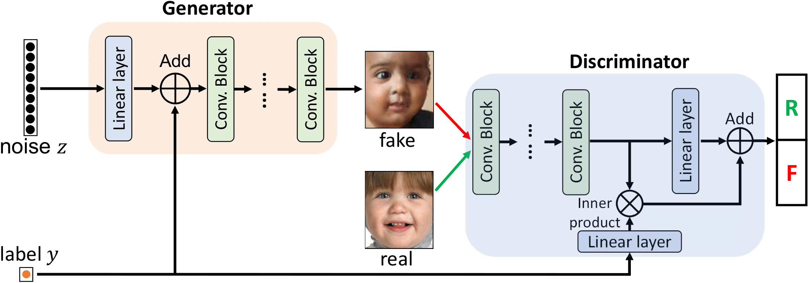
  The workflow of the naive label input (NLI) mechanism.
</p>

CNN for label embedding in ILI   |  The embedding network in ILI
:-------------------------:|:-------------------------:
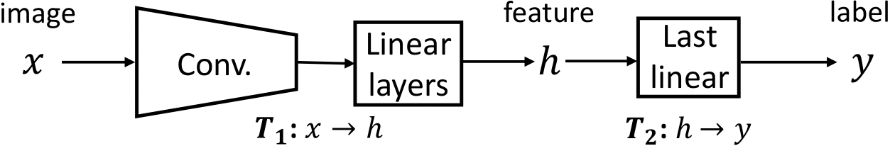  |  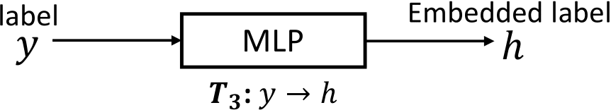

<p align="center">
  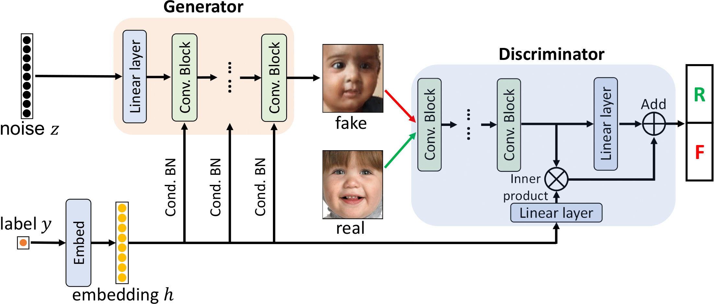
  The workflow of the improved label input (ILI) mechanism.
</p>


-------------------------------

# Software Requirements
| Item | Version |
|---|---|
|Python|3.9.5|
| argparse | 1.1 |
| CUDA  | 11.4 |
| cuDNN| 8.2|
| numpy | 1.14 |
| torch | 1.9.0 |
| torchvision | 0.10.0 |
| Pillow | 8.2.0 |
| matplotlib | 3.4.2 |
| tqdm | 4.61.1 |
| h5py | 3.3.0 |
| Matlab | 2020a |


--------------------------------------------------------

# Datasets
## The RC-49 Dataset (h5 file)
Download the following h5 files and put them in `./datasets/RC-49`.
### RC-49 (64x64)
[RC-49_64x64_download_link](https://1drv.ms/u/s!Arj2pETbYnWQstI0OuDMqpEZA80tRQ?e=fJJbWw) <br />
### RC-49 (128x128)
[RC-49_128x128_download_link](https://1drv.ms/u/s!Arj2pETbYnWQstIu_hXCzzhy6OEf9A?e=eEXl8n) <br />
### RC-49 (256x256)
[RC-49_256x256_download_link](https://1drv.ms/u/s!Arj2pETbYnWQstJyYe-EmFyKpYbBWw?e=5rYCCD) <br />

## The preprocessed UTKFace Dataset (h5 file)
Download the following h5 files and put them in `./datasets/UTKFace`.
### UTKFace (64x64)
[UTKFace_64x64_download_link](https://1drv.ms/u/s!Arj2pETbYnWQstIzurW-LCFpGz5D7Q?e=X23ybx) <br />
### UTKFace (128x128)
[UTKFace_128x128_download_link](https://1drv.ms/u/s!Arj2pETbYnWQstJGpTgNYrHE8DgDzA?e=d7AeZq) <br />
### UTKFace (192x192)
[UTKFace_192x192_download_link](https://1drv.ms/u/s!Arj2pETbYnWQstY8hLN3lWEyX0lNLA?e=YBpYwv) <br />

## The Cell-200 dataset (h5 file)
Download the following h5 files and put them in `./datasets/Cell-200`.

[Cell-200_64x64_download_link](https://1drv.ms/u/s!Arj2pETbYnWQstIt73ZfGOAjBMiTmQ?e=cvxFIN) <br />

## The Steering Angle dataset (h5 file)
Download the following h5 files and put them in `./datasets/SteeringAngle`.
### Steering Angle (64x64)
[SteeringAngle_64x64_download_link](https://1drv.ms/u/s!Arj2pETbYnWQstIyDTDpGA0CNiONkA?e=Ui5kUK) <br />
[SteeringAngle_5_scenes_64x64_download_link](https://1drv.ms/u/s!Arj2pETbYnWQstIv4_uR9Yi4SRgkBQ?e=jNFSlE) <br />
### Steering Angle (128x128)
[SteeringAngle_128x128_download_link](https://1drv.ms/u/s!Arj2pETbYnWQstJ0j7rXhDtm6y4IcA?e=bLQh2e) <br />
[SteeringAngle_5_scenes_128x128_download_link](https://1drv.ms/u/s!Arj2pETbYnWQstIwwbbZ9fKHOgbE9A?e=qdoIx6) <br />


--------------------------------------------------------

# Sample Usage

run `./scripts/run_train.sh` in the following folders. Remember to set correct root path, data path, and checkpoint path. <br />

## Low-resolution experiments (64x64)
Folders with name `CcGAN` are for the NLI-based CcGAN. Folders with name `CcGAN-improved` are for the ILI-based CcGAN. Foders with name `cGAN (concat)` are for the baseline cGAN (concat) [i.e., cGAN (concat) directly appends regression labels to the input of generator and the last hidden map of discriminator].

### Simulation (`./Simulation`): The Circular 2D Gaussians experiment in our ICLR paper [1].

### RC-49 (64x64) (`./RC-49/RC-49_64x64`)
`./RC-49/RC-49_64x64/CcGAN`: Train AE and ResNet-34 for evaluation. Train cGAN (K classes) and NLI-based CcGAN. <br />
`./RC-49/RC-49_64x64/CcGAN-improved`: Train cGAN (K classes) and ILI-based CcGAN. <br />
`./RC-49/RC-49_64x64/cGAN-concat`: Train cGAN (concat). <br />

### UTKFace (64x64) (`./UTKFace/UTKFace_64x64`)
`./UTKFace/UTKFace_64x64/CcGAN`: Train AE and ResNet-34 for evaluation. Train cGAN (K classes) and NLI-based CcGAN. <br />
`./UTKFace/UTKFace_64x64/CcGAN-improved`: Train cGAN (K classes) and ILI-based CcGAN. <br />
`./UTKFace/UTKFace_64x64/cGAN-concat`: Train cGAN (concat). <br />

### Cell-200 (64x64) (`./Cell-200/Cell-200_64x64`)
`./Cell-200/Cell-200_64x64/CcGAN`: Train AE for evaluation. Train cGAN (K classes) and NLI-based CcGAN. <br />
`./Cell-200/Cell-200_64x64/CcGAN-improved`: Train cGAN (K classes) and ILI-based CcGAN. <br />

### Steering Angle (64x64) (`./SteeringAngle/SteeringAngle_64x64`)
`./SteeringAngle/SteeringAngle_64x64/CcGAN`: Train AE and ResNet-34 for evaluation. Train cGAN (K classes) and NLI-based CcGAN. <br />
`./SteeringAngle/SteeringAngle_64x64/CcGAN-improved`: Train cGAN (K classes) and ILI-based CcGAN. <br />
`./SteeringAngle/SteeringAngle_64x64/cGAN-concat`: Train cGAN (concat). <br />

## High-resolution experiments
In high-resolution experiments, we only compare CcGAN (SVDL+ILI) with cGAN (K classes) and cGAN (concat). For all GANs, we use **SAGAN** [3] as the backbone. We also use **hinge loss** [2] and **DiffAugment** [4].

### RC-49 (128x128)
`./RC-49/RC-49_128x128\CcGAN-improved`: Train AE and ResNet-34 for evaluation. Train cGAN (K classes), cGAN (concat) and CcGAN (SVDL+ILI). <br />

### RC-49 (256x256)
`./RC-49/RC-49_256x256\CcGAN-improved`: Train AE and ResNet-34 for evaluation. Train cGAN (K classes), cGAN (concat) and CcGAN (SVDL+ILI). <br />

### UTKFace (128x128)
`./UTKFace/UTKFace_128x128\CcGAN-improved`: Train AE and ResNet-34 for evaluation. Train cGAN (K classes), cGAN (concat) and CcGAN (SVDL+ILI). <br />

### UTKFace (192x192)
`./UTKFace/UTKFace_192x192\CcGAN-improved`: Train AE and ResNet-34 for evaluation. Train cGAN (K classes), cGAN (concat) and CcGAN (SVDL+ILI). <br />

### Steering Angle (128x128)
`./SteeringAngle/SteeringAngle_128x128\CcGAN-improved`: Train AE and ResNet-34 for evaluation. Train cGAN (K classes), cGAN (concat) and CcGAN (SVDL+ILI). <br />


--------------------------------------------------------

# Computing NIQE
The code for computing NIQE is in `./NIQE`. Let's take RC-49_128x128 (in `./NIQE/RC-49/NIQE_128x128`) as an example. First, create a folder `./NIQE/RC-49/NIQE_128x128/fake_data` where we store the folder that concains fake images generated from a CcGAN or a cGAN. Second, rename the folder that contains fake images to `fake_images`, i.e., `./NIQE/RC-49/NIQE_128x128/fake_data/fake_images`. Third, unzip `./NIQE/RC-49/NIQE_128x128/models/unzip_this_file.zip` (containing pre-trained NIQE models). Fourth, run `./NIQE/RC-49/NIQE_128x128/run_test.bat`. Please note that in this directory, we only provide a Windows batch script to run the evaluation. Please modify it to fit Linux system.

--------------------------------------------------------

# Some Results

## Example fake images from CcGAN in high-resolution experiments
<p align="center">
  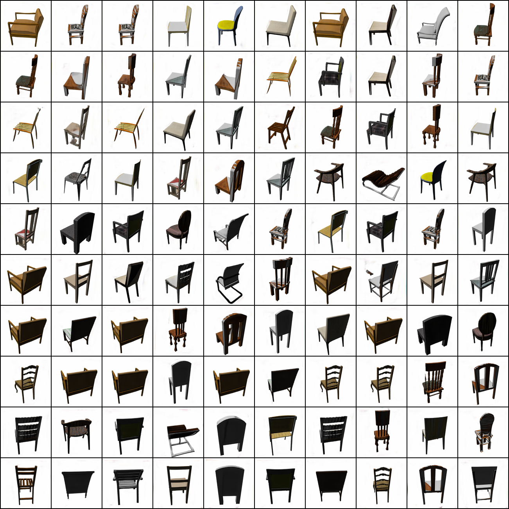
  Example 128X128 fake RC-49 images generated by CcGAN (SVDL+ILI) with angles varying from 4.5 to 85.5 degrees (from top to bottom).
</p>

<p align="center">
  
  Example 192x192 fake UTKFace images generated by CcGAN (SVDL+ILI) with ages varying from 3 to 57 (from top to bottom).
</p>

<p align="center">
  
  Example 128x128 fake Steering Angle images generated by CcGAN (SVDL+ILI) with angles varying from -71.9 to 72 degrees (from top to bottom).
</p>

## Line graphs for low-resolution experiments
<p align="center">
  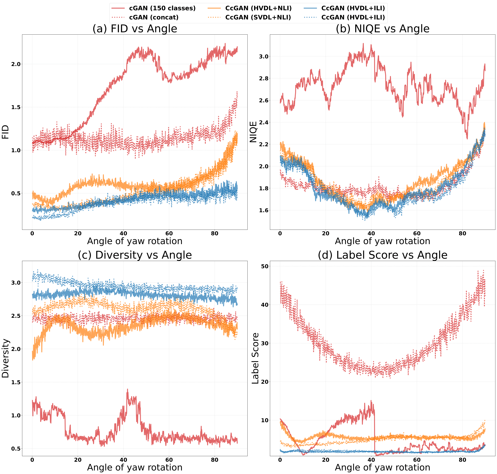
  Line graphs for the RC-49 experiment.
</p>

<p align="center">
  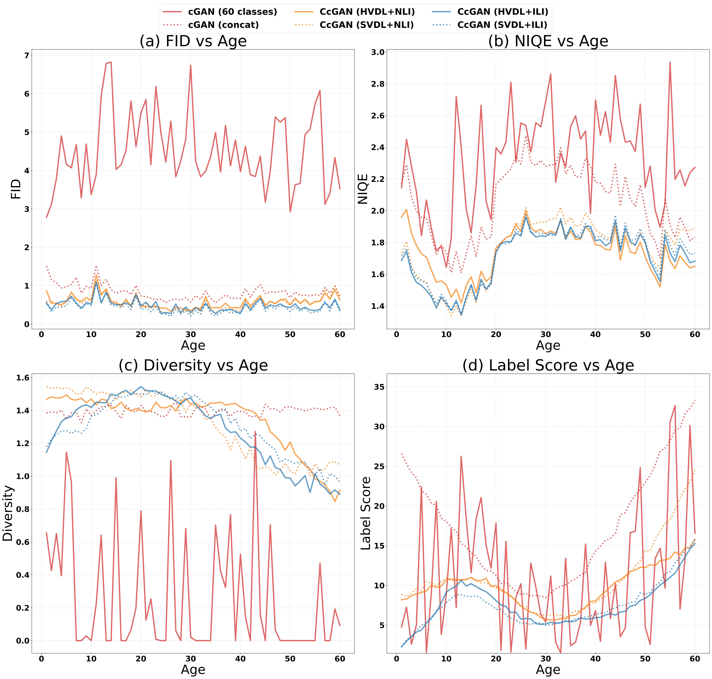
  Line graphs for the UTKFace experiment.
</p>

<p align="center">
  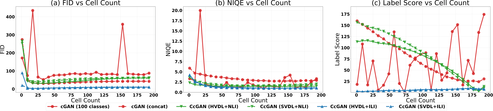
  Line graphs for the Cell-200 experiment.
</p>

<p align="center">
  
  Line graphs for the Steering Angle experiment.
</p>


-------------------------------
## References
[1] Ding, Xin, et al. "CcGAN: Continuous Conditional Generative Adversarial Networks for Image Generation." International Conference on Learning Representations. 2021.  <br />
[2] Lim, Jae Hyun, and Jong Chul Ye. "Geometric GAN." arXiv preprint arXiv:1705.02894 (2017).  <br />
[3] Zhang, Han, et al. "Self-attention generative adversarial networks." International conference on machine learning. PMLR, 2019.  <br />
[4] Zhao, Shengyu, et al. "Differentiable Augmentation for Data-Efficient GAN Training." Advances in Neural Information Processing Systems 33 (2020).  <br />
