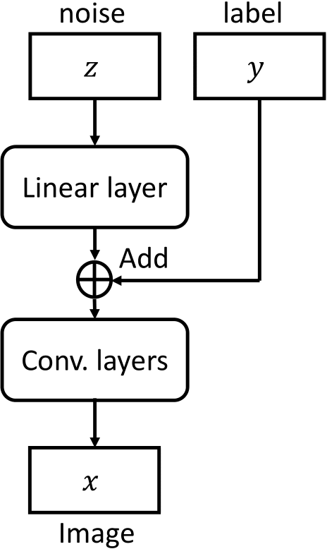
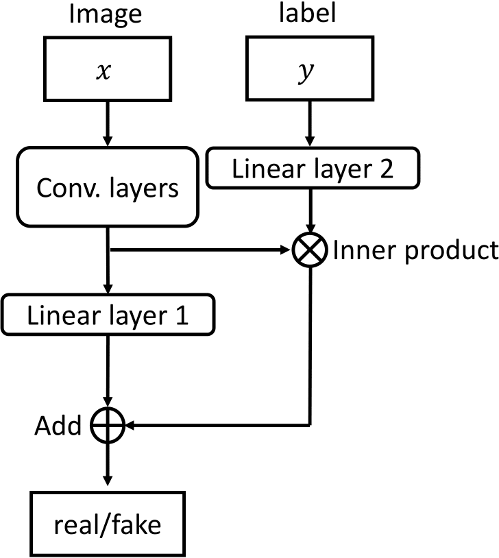
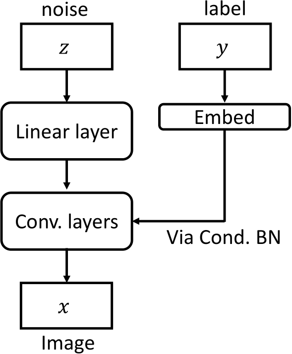
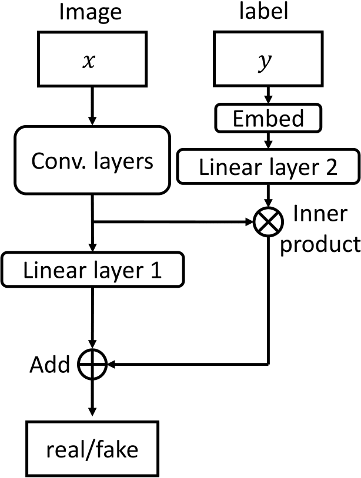

# Continuous Conditional Generative Adversarial Networks

This repository provides the source codes for the experiments in our papers for CcGANs. <br />
If you use this code, please cite
```text
@inproceedings{
      ding2021ccgan,
      title={Cc{GAN}: Continuous Conditional Generative Adversarial Networks for Image Generation},
      author={Xin Ding and Yongwei Wang and Zuheng Xu and William J Welch and Z. Jane Wang},
      booktitle={International Conference on Learning Representations},
      year={2021},
      url={https://openreview.net/forum?id=PrzjugOsDeE}
}

@misc{ding2020continuous,
      title={Continuous Conditional Generative Adversarial Networks for Image Generation: Novel Losses and Label Input Mechanisms},
      author={Xin Ding and Yongwei Wang and Zuheng Xu and William J. Welch and Z. Jane Wang},
      year={2020},
      eprint={2011.07466},
      archivePrefix={arXiv},
      primaryClass={cs.CV}
}
```

# Hard Vicinal Discriminator loss (HVDL) and Soft Vicinal Discriminator loss (SVDL)


# Naive Label Input (NLI) and Improved Label Input (ILI) mechanisms

NLI for G                  |  NLI for D
:-------------------------:|:-------------------------:
  |  

ILI for G                  |  ILI for D
:-------------------------:|:-------------------------:
  |  

# 1. Datasets
## The RC-49 Dataset (h5 file)
https://1drv.ms/u/s!Arj2pETbYnWQr7MY2Pr5qipSUpZKEQ?e=QTbiq2 <br />

Download 'RC-49_64x64.h5' and put it in './improved_CcGAN/dataset/RC-49'

## The preprocessed UTKFace Dataset (h5 file)
https://1drv.ms/u/s!Arj2pETbYnWQr7MW_sGY9tJC4G3eMw?e=ohhRTe <br />

Download 'UTKFace_64x64.h5' and put it in './improved_CcGAN/dataset/UTKFace'

## The Cell-200 dataset (h5 file)
https://1drv.ms/u/s!Arj2pETbYnWQr8tDP9Etf16nWddoTQ <br />

Download 'Cell200_64x64.h5' and put it in './improved_CcGAN/dataset/Cell200'

## The Steering Angle dataset (h5 file)
For CcGAN, AE, and Regression CNN training: <br />
https://1drv.ms/u/s!Arj2pETbYnWQr7Mdwe6H-IS0YwXh3A?e=U0BiIq <br />

For Clssification CNN training: <br />
https://1drv.ms/u/s!Arj2pETbYnWQr8xEgY3ZHSe2b1CHlQ?e=SE7pv6 <br />

Download 'SteeringAngle_64x64.h5' and 'SteeringAngle_5_scenes_64x64' and put them in './improved_CcGAN/dataset/SteeringAngle'


# 2. Sample Usage

If a folder has 'improved' in its name, this folder corresponds to a ILI-based CcGAN; otherwise, a NLI-based CcGAN.

## 2.1 Simulation ('./improved_CcGAN/Simulation')
First, set the ROOT_PATH and DATA_PATH in the './scripts/run_train.sh' to yours.

Then, run 'run_train.sh'.


## 2.2 RC-49 ('./improved_CcGAN/RC-49' and './improved_CcGAN/RC-49-improved'')
First, set the ROOT_PATH and DATA_PATH in the './scripts/run_train.sh' to yours.

Then, run 'run_train.sh'.


## 2.3 UTKFace ('./improved_CcGAN/UTKFace' and './improved_CcGAN/UTKFace-improved')
First, set the ROOT_PATH and DATA_PATH in './scripts/run_train.sh' to yours.

Then, run 'run_train.sh'.


## 2.4 Cell-200 ('./improved_CcGAN/Cell200' and './improved_CcGAN/Cell200-improved')
First, set the ROOT_PATH and DATA_PATH in './scripts/run_train.sh' to yours.

Then, run 'run_train.sh'.


## 2.5 Steering Angle ('./improved_CcGAN/SteeringAngle' and './improved_CcGAN/SteeringAngle-improved')
First, set the ROOT_PATH and DATA_PATH in './scripts/run_train.sh' to yours.

Then, run 'run_train.sh'.


# 3. NIQE
The code for computing NIQE is in './improved_CcGAN/NIQE'. Corresponding tutorial will be provided soon.
